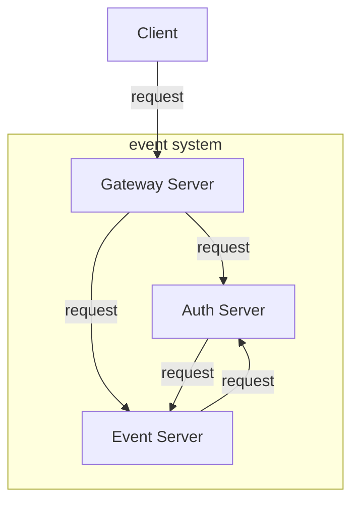
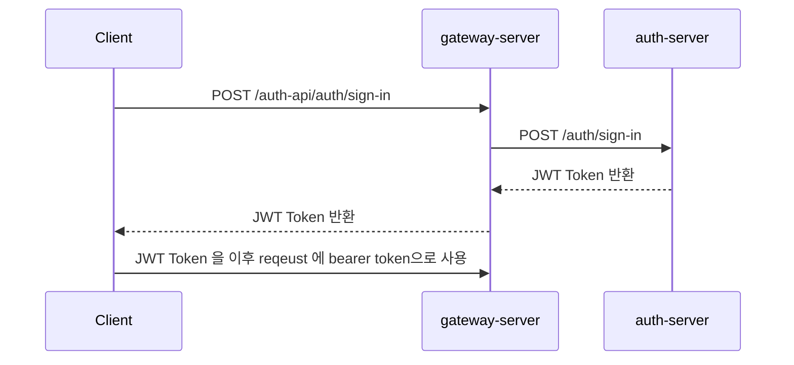
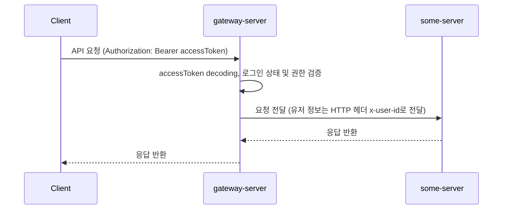

## Overview
본 repository는 세가지 서비스가 모노레포로 구성되어 있습니다.
```
├── docker-compose.dev.yml
├── gateway-server/ API gateway 서버
├── auth-server/ 인증 & 유저 서버
└── event-server/ 이벤트 서버
```

서버 구조도는 다음과 같습니다:


## Installation
개발서버 실행방법은 다음과 같습니다.
1. 본 repository의 루트 디렉토리로 이동하세요
2. 샘플 환경변수 파일 `.env.sample` 을 복사하여 이름을 `.env`로 변경합니다. 필요한 경우 환경변수 값을 적절히 변경해 사용해주세요. 다음은 변경이 필요할 수 있는 환경변수입니다.
   1. `ROOT_USERNAME` & `ROOT_PASSWORD`: 초기에 생성될 루트 사용자의 username과 비밀번호입니다.
   2. `JWT_SECRET`: JWT 인코딩에 사용될 secret key 값입니다. gateway-server 에서 JWT 디코딩을, auth-server 에서는 JWT 인코딩을 수행하기 때문에, 두 서비스에서 같은 값을 가져야 정상적인 인증이 가능합니다. 또한, **운영환경 배포시 반드시 변경해서 사용부탁드립니다.**
   3. `EXPIRES_IN`: JWT 토큰의 유효시간입니다. (기본값: 60분)

3. 다음 명령을 수행합니다.
    ```sh
    $ docker-compose -f docker-compose.dev.yml up --build
    ```
    

서버가 실행되면 gateway-server 의 API을 `localhost:3000`으로 요청하실 수 있습니다.

### API Documentation
API 문서는 Swagger 를 사용해 생성되고 있습니다. API 호출 테스트가 필요하신 경우에 사용해주세요.
Swagger 접속 URL: http://localhost:3000/api-docs

#### 인증, 인가가 필요한 경우 API호출
일부 API는 로그인이 필요하거나, 특정 역할 권한이 필요할 수 있습니다. 그러한 경우 Swagger 에서 다음과 같은 방식으로 로그인할 수 있습니다.
1. `/auth-api/auth/sign-in` API를 호출합니다.
2. swagger 화면 우상단의 Authorize 버튼을 누르고 응답 결과의 `accessToken` 항목을 복사 붙여넣기 합니다.

TODO: 이미지 추가하기

### MongoDB 로컬 접근
서비스는 내부적으로 2대의 MongoDB 인스턴스를 사용합니다. 디버깅을 위해 DataGrip 또는 MongoDB Compass와 같은 도구로 로컬에서 확인이 필요하신 경우 아래 주소로 DB를 접근할 수 있습니다. (인증 없음, **운영환경에선 포트 노출 삭제 필요**)
- `auth-mongo`: localhost:27017
- `event-mongo`: localhost:27018

## 로직 상세
### 인증 & 인가
로그인이 이루어지는 과정입니다.


로그인 상태 이후에 권한 인증이 이루어지는 과정입니다.


gateway-server 에서 인증 및 인가는 NestJS의 guard를 사용한 decorator로 이루어집니다. 다음은 `Role.OPERATOR` 또는 `Role.ADMIN` 만 접근할 수 있는 API route 예시입니다:
```typescript
@RoleRequired([Role.OPERATOR, Role.ADMIN])
@Post('event/create')
async createEvent(@Req() req: Request) {
    return await this.forward(req);
}
```
데코레이터는 passport jwt strategy에 의해 request 객체에 삽입된 jwt payload의 내용을 분석해 요청을 인증/인가 여부를 결정합니다.

때로는 리소스 서버에서 해당 요청을 발생시킨 유저의 ID를 확인할 필요가 있습니다. 그럴때는 다음과 같은 `@UserId()` 데코레이터를 controller 에서 사용하면, userId 를 HTTP 헤더 `x-user-id` 에서 자동으로 추출할 수 있습니다:
```typescript
@Post(':eventId/request-reward')
  async requestReward(@Param('eventId') id: string, @UserId() userId: string) {
    const rewardReceipt = await this.eventService.provideReward(id, userId);
    return {
      message: '보상 수령에 성공했습니다.',
      rewardReceipt,
    };
  }
```

### Gateway의 역할
1. gateway-server 는 auth-server 및 event-server 의 API중 클라이언트에게 노출할 API만 선택적으로 노출하는 창구 역할을 수행합니다.
2. 클라이언트에게 노출되는 API들에 대한 인증/인가 정책을 설정할 수 있고, 실제로 인증/인가를 한 후 유저 정보를 리소스 서버에게 전달합니다.


## TODO
- [ ] 복잡한 중첩된 이벤트 완료 조건을 지원하기. 예시:
    ```
    {
        "operator": "and", // or, not, ...
        "conditions": [...]
    }
    ```
- [ ] 이벤트 또는 보상등록 API등 사용시 body validation 추가하기.


## Misc.
개발도중 의존성 변경이 발생한다면, 컨테이너에 접속후 수동 의존성 설치 필요
```sh
$ docker exec -it <서버이름, e.g. gateway-server> sh
$ npm install
```
